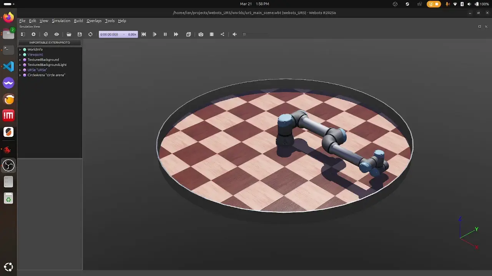

# UR5e Simulation

## Summary
In my [previous project](https://github.com/ianhong95/5DOFRobotArmV2) where I built my own 5-DOF robot arm, I learned that the Denavit-Hartenberg method for computing kinematics was quite inefficient as it involved a convoluted frame assignment procedure and many successive transformation matrix multiplications. I also crashed the robot quite a few times due to both major and minor math errors.

The purpose of this project is to deep dive into Screw Theory and numerical solvers as a more robust, computationally efficient, and universal method to control a robot arm. This method handles singularities more elegantly than the D-H method. The UR5e in a simulation environment enables me to experiment with kinematics formulas without going broke and worrying about breaking a physical robot.

## Kinematics
To solve the forward and inverse kinematics, I followed the theory detailed in Lynch and Park's Modern Robotics book. It is focused around Screw Theory, where every rigid body motion can be described by a rotation and translation along a single screw axis. Due to the complexity of this method, there are no analytical solutions so the motions are solved numerically using the Newton-Raphson iterative approach.

The details of the math are documented in the `docs` [README](/docs/README.md) with supplementary linear algebra notes [here](docs/Linear_Algebra.md).

## Current Functionality
The current state of this project is still quite basic. The kinematics library is complete to the point where it am able to compute the end-effector's pose based on current joint angles (forward kinematics), and it can solve the joint angles required to achieve a desired end-effector pose (inverse kinematics).

## Control
Using a PID control loop and speed ramp-up logic in the main motion method, the arm can move more smoothly rather than jerking to an initial velocity.

PID control loop without speed ramp-up:

PID control loop with speed ramp-up:

The jump in the middle of the motions is due to the speed being capped in the middle of an acceleration. This will need the accelerations and limits to be tuned.

## Further Development
The simulation environment unlocks many opportunities to explore control theory and optimization techniques. For example, sensor feedback can be integrated to provide a less primitive control scheme, and perhaps other numerical methods can improve accuracy and repeatability. Some features/concepts that I would like to explore are:

* PID control loop [in progress]
* Smooth linear motions (rather than swinging in a random arc to the destination) [in progress]
* Gradient descent instead of Newton-Raphson
* Mathematical stability of inverse kinematics
